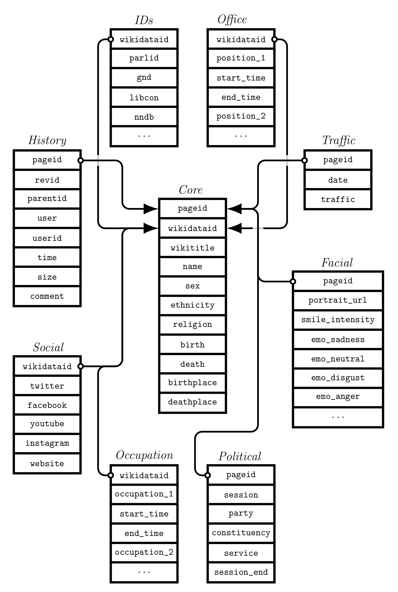

# legislatoR: Political, sociodemographic, and  <br /> Wikipedia-related data on political elites 

legislatoR is a fully relational individual-level data package for the software environment R. It comprises political, sociodemographic, and Wikipedia-related data on elected politicians across the globe. The current development version (0.0.0.9000) includes 22,917 elected politicians from all legislative sessions of the Austrian Nationalrat, the German Bundestag, the Irish Dáil, the French Assemblée, and the United States Congress (House and Senate).

## Motivation
Researchers, students, analysts, journalists, and the public continue to rely on individual-level data on political elites for various kinds of analyses, whether theory-driven or motivated by real-world problems. As a consequence, the past has likely seen recurrent data collection efforts with the same purpose. This practice is highly inefficient. Student assistants, interns, or volunteers work on tedious data collection tasks likely accomplished by others already. Financial limitations or time restrictions often force analysts to limit their analyses to a subset of politicians. The frequent compromise is between broad (many politicians) but shallow (few variables) or narrow (few politicians) but deep (many variables) data. Existing data structures are either limited in scope, hidden behind paywalls, or simply not accessible to those who are not super tech-savvy. legislatoR strives to be a free, efficient, and accessible one stop shop for broad and deep data on political elites, facilitate data integration, enable replication efforts, and preserve data that may one of these days cease to exist on some of the numerous sources on the Web.

## Content and data structure
For each legislature, the package currently holds nine datasets: 

1.  *Core* (basic sociodemographic data)
2.  *Political* (basic political data)
3.  *History* (full revision records of individual Wikipedia biographies)
4.  *Traffic* (daily user traffic on individual Wikipedia biographies from July 2015 to October 2017)
5.  *Social* (social media handles and personal website URLs)
6.  *Facial* (URLs to individual Wikipedia portraits and a range of facial recognition estimates based on these portraits)
7.  *Office* (public offices)
8.  *Occupation* (professions)
9.  *IDs* (a range of identifiers linking a politician to another file, database, or website)
 
The datasets contain the following variables (see the respective R help files for further details):

- *Core*: Wikipedia page ID, Wikidata ID, Wikipedia URL, full name, sex, ethnicity, religion, date of birth and death, place of birth and death.
- *Political*: Wikipedia page ID, legislative session, party affiliation, constituency, start and end date of legislative session, period of service.
- *History*: Wikipedia page ID, Wikipedia revision and previous revision ID, editor name/IP and ID, revision date and time, revision size, revision comment.
- *Traffic*: Wikipedia page ID, date, user traffic.
- *Social*: Wikidata ID, Twitter handle, Facebook handle, Youtube ID, Google Plus ID, Instagram handle, LinkedIn ID, personal website URL.
- *Facial*: Wikipedia page ID, Wikipedia portrait URL, smile intensity, expressed sadness, expressed neutrality, expressed disgust, expressed anger, expressed surprise, expressed fear, expressed happiness, beauty from female and male perspective, dark circles, spots, acne, healthy skin, image quality.
- *Office*: Wikidata ID, a range of offices such as attorney general, chief justice, mayor, party chair, secretary of state, etc.
- *Occupation*: Wikidata ID, a range of professions such as accountant, farmer, historian, judge, mechanic, police officer, salesperson, teacher, etc.
- *IDs*: Wikidata ID, a range of IDs such as parliamentary website IDs, Library of Congress or German National Library IDs, Notable Names Database or Project Vote Smart IDs, etc.
 
Please note that for some legislatures or legislative periods, datasets may only hold data on a small subset of politicians, yield a substantial amount of missings for specific variables, or lack specific variables altogether. Successive versions of legislatoR may fill some of these gaps.

The relational quality of legislatoR means that all datasets can be joined with the *Core* dataset via one of two keys - the Wikipedia page ID or the Wikidata ID, which uniquely identify individual politicians. The figure below illustrates this structure and some of the package content.

<p align="center">
  
</p>

## Installation
The current development version of legislatoR (0.0.0.9000) is only available through GitHub. To install the package in `R`, type:

```r
devtools::install_github("saschagobel/legislatoR")
```

## Usage


After having installed the package, a working Internet connection is required in order to access the data in R. This is because the data are not installed with the package, but are stored on legislatoR's GitHub repository. The package provides dataset-specific function calls to fetch the data from the repository. These functions are named after the datasets and preceded by `get_`. To fetch  the *Core* dataset, use the `get_core` function, for the *Political* dataset, use the `get_political` function, and so on (see [above](#content-and-data-structure) for dataset names). The datasets are all legislature-specific. To access a dataset in R the legislature's code must be passed as an argument to the respective dataset's function call. The legislature codes are:

| Legislature          | Code        | Legislature      | Code       | Legislature          | Code          |
| -------------------- |:-----------:| ---------------- |:----------:| -------------------- |:-------------:|
| Austrian Nationalrat | `austria`   | German Bundestag | `germany`  | United States House  | `usah`        |
| French Assemblée     | `france`    | Irish Dáil       | `ireland`  | United States Senate | `usas`        | 

Data can be joined and subsetted while being fetched from the repository and memory is only allocated by the parts of a dataset assigned into the environment. The data fetching, joining and subsetting stages are illustrated in the code below.

```r
# load and attach legislatoR and dplyr packages
library(legislatoR)
library(dplyr)

# assign entire Core dataset for the German Bundestag into the environment
ger_politicians <- get_core(legislature = "germany")

# assign only data for the 8th legislative session into the environment
ger_politicians_subset <- semi_join(x = get_core(legislature = "germany"),
				    y = filter(get_political(legislature = "germany"), session == 8), 
			            by = "pageid")

# join ger_politicians_subset with respective History dataset
ger_history <- left_join(x = ger_politicians_subset, 
               		 y = get_history(legislature = "germany"), 
		         by = "pageid")

# assign only birthdate for members of the political party 'SPD' into the environment
ger_birthdates_SdP <- semi_join(x = select(get_core(legislature = "germany"), pageid, birth),
                                y = filter(get_political(legislature = "germany"), party == "SPD"),
                                by = "pageid")$birth
```

For each dataset, there is a help file with details on content and usage examples.

```r
# call help file for legislatoR package to get an overview of the function calls
?legislatoR

# call help file for the 'History' dataset 
?get_history
```

## Example analyses
Coming soon

## News
Coming soon

## Teaser
Coming soon

## Sources
legislatoR was predominantly built using automated data extraction techniques. See the [source code](source) for more details. The package was assembled using the following Web sources or tools:

[Face++ Cognitive Services API](https://www.faceplusplus.com/) <br />
[Wikimedia Commons](https://commons.wikimedia.org/) <br />
[Wikidata API](https://www.wikidata.org/) <br />
[Wikipedia](https://de.wikipedia.org/) <br />
[Wikipedia API](https://en.wikipedia.org/w/api.php) 

## Citation
Thank you for using legislatoR! Please consider citing:

Göbel, Sascha and Simon Munzert. (2017). legislatoR: Political, sociodemographic, and Wikipedia-related data on political elites. Source: https://github.com/saschagobel.

## Support
The work on this package was in part funded by the Daimler and Benz Foundation (Funding period 2017/18; project "Citizen and Elite Activity on the Wikipedia Market Place of Political Information").

## Author information

**Sascha Göbel** (corresponding author and repository maintainer) <br />
University of Konstanz <br />
Graduate School of Decision Sciences and Center for Data and Methods <br />
Box 85 <br />
D-78457 Konstanz, Germany <br />
Email: sascha.goebel@uni-konstanz.de 

**Simon Munzert** <br />
Hertie School of Governance <br />
Quartier 110 - Friedrichstrasse 180 <br />
D-10117 Berlin, Germany <br />
Email: munzert@hertie-school.org
